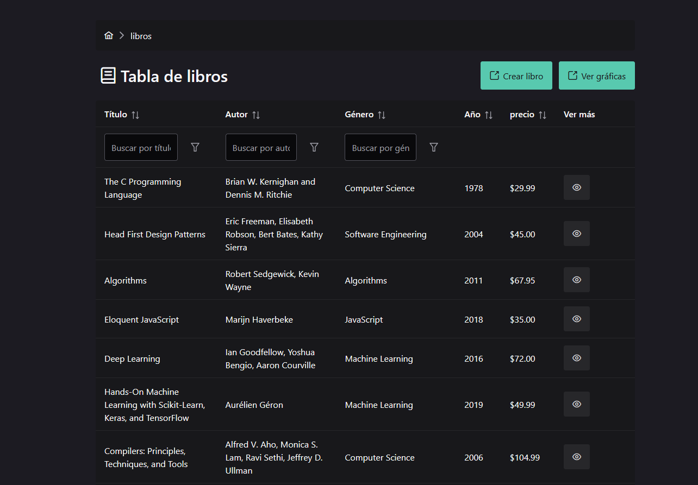
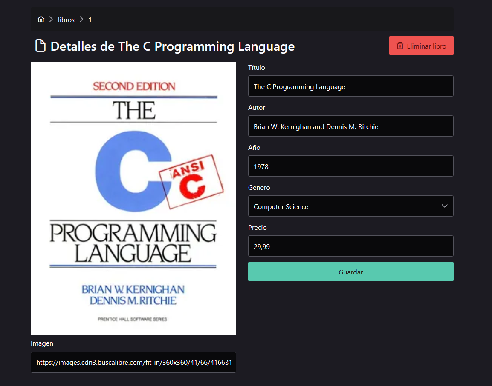
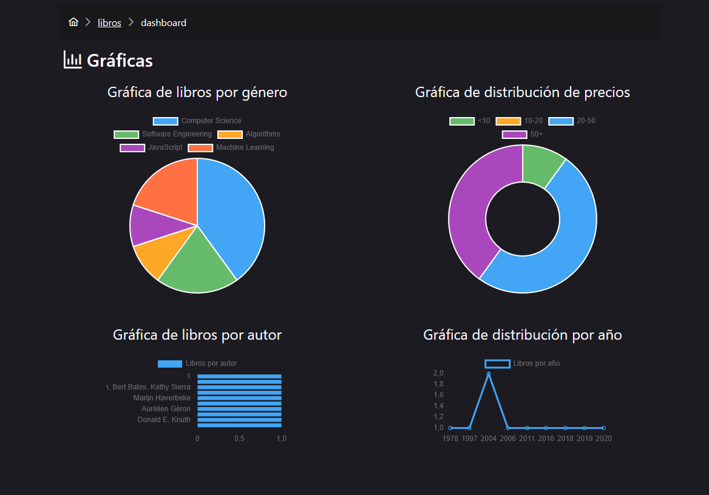

# 📚 Book Manager — Vue 3 + TypeScript

Aplicación web para gestionar una colección de libros. Permite visualizar, crear, editar y eliminar libros. Incluye un backend sencillo para las operaciones CRUD y un dashboard de estadísticas.

---

## 🚀 **Características principales**

- 📄 **CRUD completo**: ver, crear, editar y eliminar libros.
- 🧪 Validaciones en tiempo real en formularios.
- 🔍 Búsqueda instantánea y filtros por género.
- 📊 Dashboard de estadísticas con gráficos.
- 🌐 API REST propia para persistencia.
- 💾 Estado global manejado con Pinia.
- 🎨 Estilos responsivos con Tailwind y PrimeVue.
- ⚛️ Estructura basada en Atomic Design.
- ✅ Buenas prácticas: ESLint + Prettier, tipado con TypeScript.

---

## 🧰 **Tecnologías**

- [Vue 3](https://vuejs.org/) + TypeScript
- [PrimeVue](https://primevue.org/) (DataTable, Dialog, Toast, Chart)
- [Pinia](https://pinia.vuejs.org/)
- [Vue Router](https://router.vuejs.org/) con lazy loading
- [TailwindCSS](https://tailwindcss.com/)
- [Express](https://expressjs.com/) API backend REST
- [Zod](https://zod.dev/) para validaciones de datos

---

## 📦 **Requisitos**

- Node.js ≥ 18
- npm ≥ 9

---

## 🔷 **Instalación**

Primero, muévete a la carpeta de backend, instala las dependencias y levanta la API:

```bash
cd book-app-backend
npm install
npm run dev
```

Luego, en otra terminal, vuelve a la carpeta raíz e instala las dependencias:

```bash
cd book-app-frontend
npm install
npm run dev
```

---

## 🗂️ **Estructura de carpetas**

```text
src/
  components/
    atoms/         # Componentes atómicos
    molecules/     # Componentes simples combinados
    organisms/     # Componentes complejos
    templates/     # Layouts de página
  pages/           # Vistas
  utils/           # Funciones utilitarias
  constants/       # Valores constantes
  interfaces/      # Interfaces de modelos
  store/           # Pinia
  constants/       # Valores constantes
```

### 📐 Atomic Design aplicado

- **Átomos**: elementos básicos de UI reutilizables.
- **Moléculas**: combinaciones simples de átomos.
- **Organismos**: secciones completas de la UI.
- **Templates**: estructura base de las páginas.
- **Pages**: páginas completas con datos reales.

---

## 🖼️ **Capturas**

📷 Puedes incluir aquí un GIF corto o imágenes de las principales vistas:





---

## 🧪 **Comandos**

| Comando         | Descripción                      |
| --------------- | -------------------------------- |
| `npm run dev`   | Inicia la app en modo desarrollo |
| `npm run check` | Validaciones con Prettier        |
| `npm run write` | Correcciones con Prettier        |

---

## 📋 **Buenas prácticas**

- ✅ ESLint + Prettier configurados.
- ✅ Commits semánticos.
- ✅ Tipado estricto en todos los modelos.
- ✅ Errores de API manejados con toast y opción retry.

---

## 📊 **Bonus**

- 📈 Dashboard de estadísticas (`/stats`) con gráficos.
- 🌙 Dark mode según el tema del dispositivo.

---
